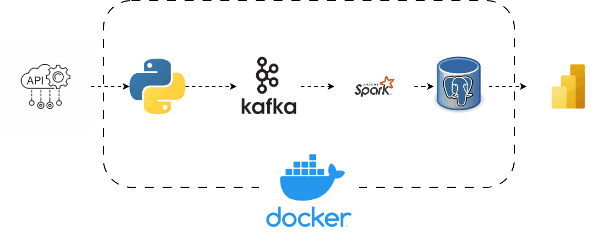

# Real-Time Stock Market Analysis

A comprehensive real-time stock market analysis platform designed to provide advanced insights into predictive stock movements and trading signals. This system integrates multiple data sources to deliver low-latency analytics for high-frequency traders and asset managers.

## Overview

MarketPulse's real-time stock market analysis platform processes vast amounts of financial data from stock exchanges, news feeds, and social sentiment sources. The current data pipeline, while functional, faces significant challenges in handling growing data volumes and maintaining ultra-low latency requirements, particularly during peak market periods like stock market opens and earnings reports.

## Key Features

- **Real-Time Data Streaming**: Continuous ingestion of market data using Apache Kafka
- **Advanced Analytics**: Predictive modeling for stock movements and trading signals
- **Scalable Processing**: Distributed data processing with Apache Spark
- **Historical Data Storage**: Robust storage and retrieval with PostgreSQL
- **Containerized Deployment**: Docker-based architecture for portability and scalability
- **Multi-Source Integration**: Aggregation of diverse data sources including:
  - Stock exchange feeds
  - Financial news APIs
  - Social media sentiment analysis
  - Economic indicators

## Architecture

### Technology Stack

- **Python**: Core language for data integration, processing, and API interactions
- **Apache Kafka**: Real-time data streaming and messaging
- **Apache Spark**: Large-scale data processing and real-time analytics
- **PostgreSQL**: Relational database for historical data and reporting
- **Docker**: Containerization for deployment and scalability




### System Components

- **Producer**: Data ingestion and streaming to Kafka topics
- **Consumer**: Real-time data processing and analytics
- **Analytics Engine**: Predictive modeling and signal generation
- **Storage Layer**: Historical data persistence and querying
- **API Layer**: RESTful interfaces for client applications


## Installation

### Prerequisites

- Python 3.8+
- Docker and Docker Compose
- Apache Kafka
- Apache Spark
- PostgreSQL

### Setup

1. **Clone the repository**
   ```bash
   git clone https://github.com/oyinloluwa20/REAL-TIME-MARKET-STOCK-ANALYSIS
   cd REAL-TIME-STOCK-MARKET-ANALYSIS
   ```

2. **Create virtual environment**
   ```bash
   python -m venv venv
   source venv/bin/activate  # On Windows: venv\Scripts\activate
   ```


3. **Environment configuration**
   ```bash
   cp .env.example .env
   # Edit .env with your api keys
   ```

4. **Start infrastructure services**
   ```bash
   docker-compose up -d kafka spark postgres
   ```

## Usage

### Running the Producer

```bash
python producer/main.py
```

### Running the Consumer

```bash
python consumer/main.py
```


## Development

### Project Structure

```
REAL-TIME-STOCK-MARKET-ANALYSIS/
├── consumer/          # Kafka consumer and data processing
├── producer/          # Data ingestion and Kafka producer
├── analytics/         # Predictive modeling and analytics
├── api/              # REST API endpoints
├── config/           # Configuration files
├── tests/            # Unit and integration tests
├── docker/           # Docker configurations
├── requirements.txt  # Python dependencies
├── docker-compose.yml # Infrastructure services
└── README.md
```

### Running Tests


## Contributing

1. Fork the repository
2. Create a feature branch (`git checkout -b feature/amazing-feature`)
3. Commit your changes (`git commit -m 'Add amazing feature'`)
4. Push to the branch (`git push origin feature/amazing-feature`)
5. Open a Pull Request

## Future Improvements

- Implement robust monitoring and alerting systems
- Optimize data pipeline for ultra-low latency
- Enhance scalability with Kubernetes orchestration
- Add machine learning models for better predictions
- Implement real-time anomaly detection
- Expand data source integrations

## License

This project is licensed under the MIT License - see the [LICENSE](LICENSE) file for details.

